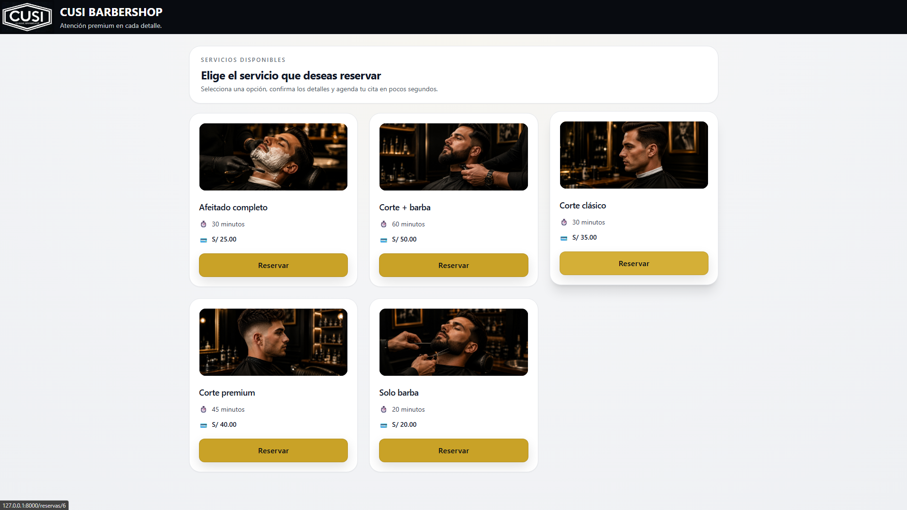
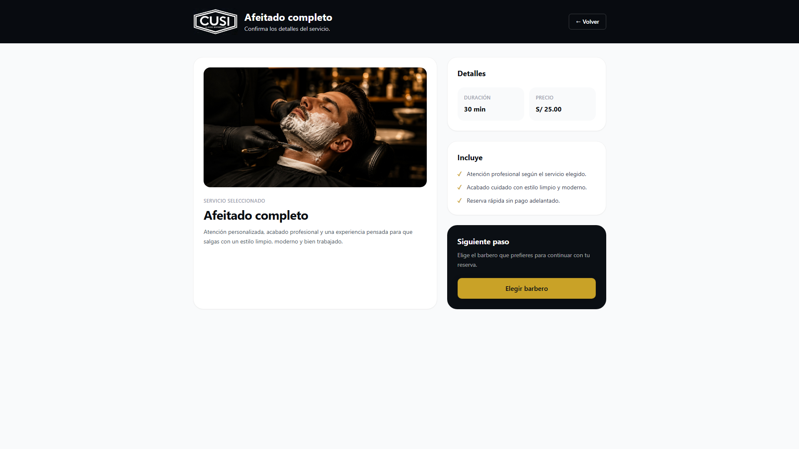
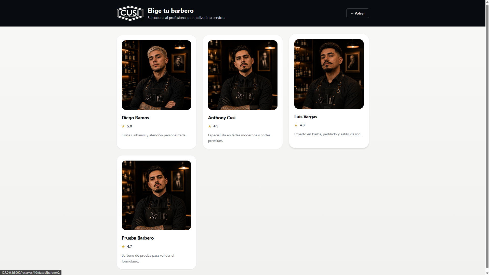
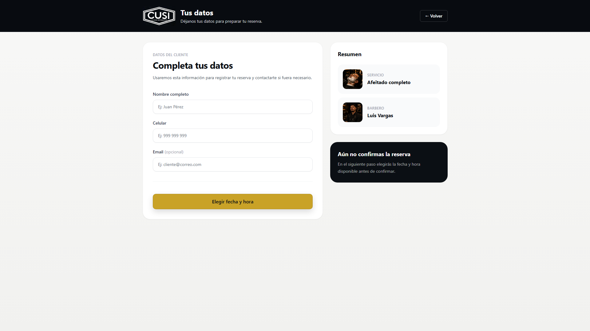
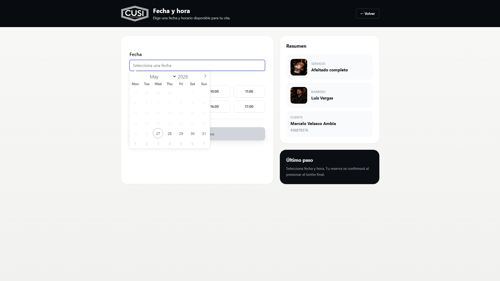
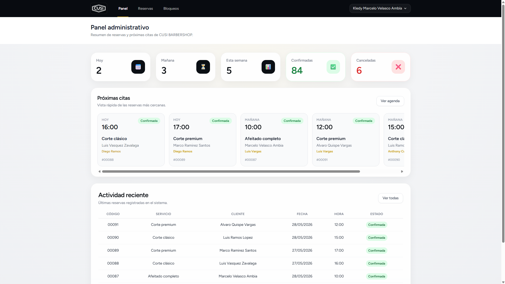

# Booklify Barbería — Sistema de reservas para barberías

Sistema de reservas online para barberías desarrollado con Laravel 12 y Tailwind CSS, enfocado en una experiencia moderna de atención y gestión de citas.

## Características

- Reservas online
- Selección de horarios
- Confirmación de citas
- Panel administrativo
- Gestión de servicios
- Interfaz responsive
- Diseño orientado a barbería premium

## Stack

- Laravel 12
- PHP
- MySQL
- Blade
- Tailwind CSS
- Vite

---

## Capturas del sistema

### Página principal de reservas

### Detalle del servicio

### Selección de barbero

### Registro de datos del cliente

### Selección de fecha y horario

### Confirmación de reserva

### Panel administrativo

---

## Flujo de reservas

1. Selección de servicio
2. Vista detallada del servicio
3. Selección de barbero
4. Registro de datos del cliente
5. Selección de fecha y horario
6. Confirmación de reserva

---

## Funcionalidades principales

- Gestión de servicios y barberos
- Reservas online
- Bloqueo de horarios
- Panel administrativo
- Validación de disponibilidad
- Confirmación de reservas
- Interfaz responsive
- Diseño personalizado para barberías

---

## Stack tecnológico

- Laravel 12
- PHP 8.3
- MySQL
- Blade
- Tailwind CSS
- Vite
- Laravel Breeze

---

## Contexto del proyecto

Booklify Barbería fue desarrollado como una propuesta de sistema moderno de reservas online orientado a barberías y pequeños negocios de atención por citas, priorizando una experiencia visual premium y un flujo de reservas simple para el cliente final.

---

## Autor

Marcelo Velasco Ambía
