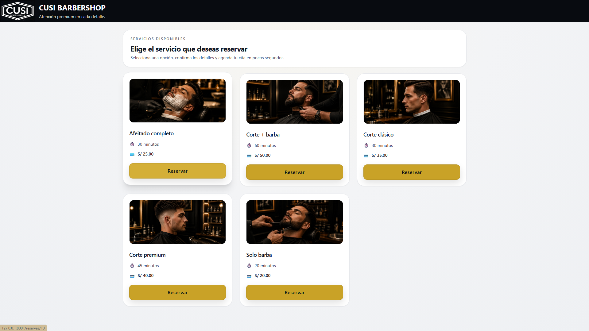
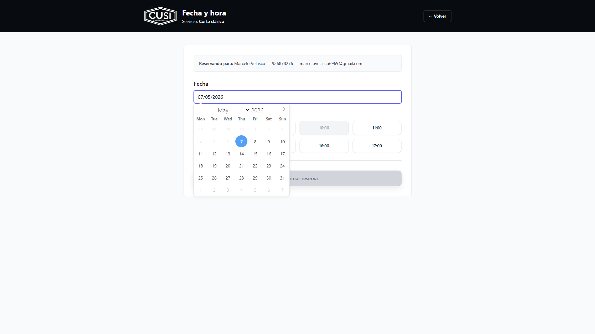
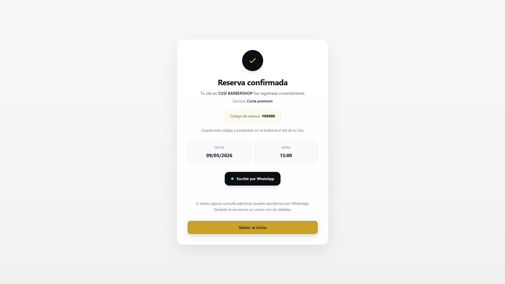
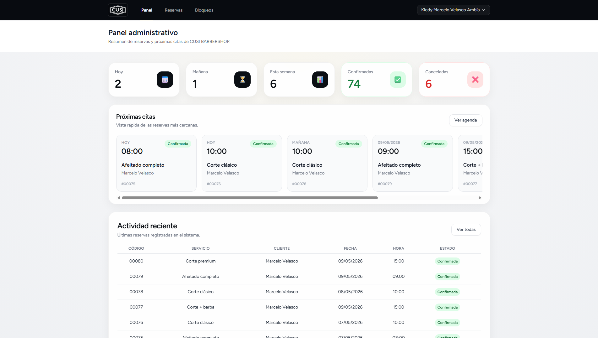

# Booklify Barbería — Sistema de reservas para barberías

Versión personalizada de Booklify orientada a barberías y negocios de cuidado personal.

El proyecto fue adaptado como demo comercial para mostrar una experiencia de reservas más visual, moderna y enfocada en atención al cliente.

## Características

- Reservas online
- Selección de horarios
- Confirmación de citas
- Panel administrativo
- Gestión de servicios
- Interfaz responsive
- Diseño orientado a barbería premium

## Stack

- Laravel 12
- PHP
- MySQL
- Blade
- Tailwind CSS
- Vite

## Capturas

### Reservas online

### Selección de horario

### Confirmación de reserva

### Panel administrativo

## Autor

Marcelo Velasco Ambía
